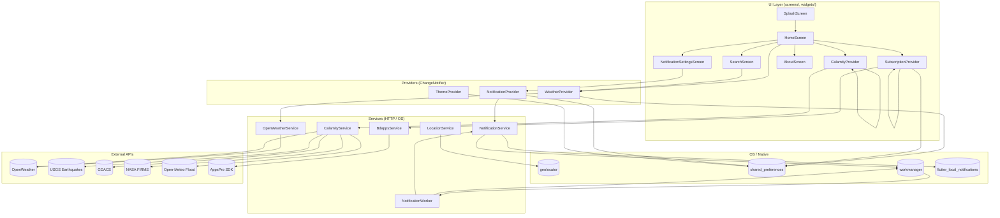
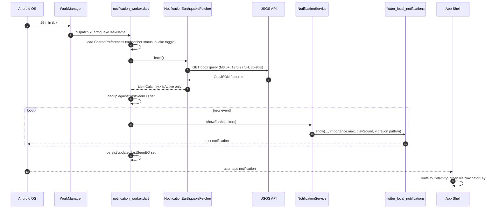
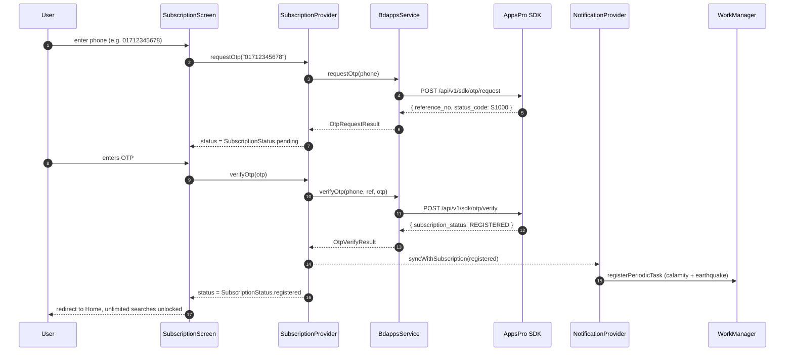
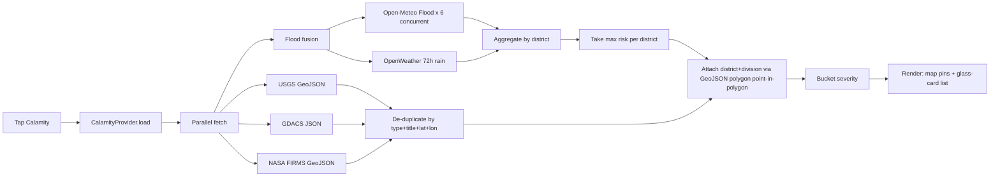

# Aakaash  Beautiful Weather for Bangladesh

<p align="center">
  
  
  
  
</p>

> **Aakaash** (*"sky"*) is a Flutter weather app built from the ground up for
> Bangladesh. Glassmorphism gradients, district-aware forecasting, an **intelligent
> natural-calamity radar curated for Bangladesh**, and a BDApps subscription gate
> that monetises without ads, banners, or trackers.

<p align="center">
  <em>Made for Dhaka's monsoon, Sylhet's hills, the Sundarbans' storms, and every
  upazila in between.</em>
</p>

<div align="center">
  <h2>📥 Download the App</h2>
  <a href="https://github.com/AbirHasanArko/Aakaash/releases/tag/v1.0.0">
    
  </a>
  &nbsp;&nbsp;
  <a href="https://appspro.dev/app/mndwrYr5dR">
    
  </a>
</div>

---

## Table of Contents

- [Why Aakaash?](#why-aakaash)
- [Screenshots & UX](#screenshots--ux)
- [Feature Highlights](#feature-highlights)
  - [The Intelligent Natural Calamity Radar  Curated for Bangladesh](#the-intelligent-natural-calamity-radar--curated-for-bangladesh)
  - [Forecasting, glassmorphism, and daily-thinking](#forecasting-glassmorphism-and-daily-thinking)
  - [AI Weather Insights (Premium)](#ai-weather-insights-premium)
  - [Farmer's Corner (কৃষকের কোণ)](#farmers-corner-কৃষকের-কোণ)
  - [Bangladesh-first city search & GPS](#bangladesh-first-city-search--gps)
  - [Smart notifications  three layers, zero noise](#smart-notifications--three-layers-zero-noise)
  - [BDApps subscription  paid feature, no payment UX](#bdapps-subscription--paid-feature-no-payment-ux)
- [Architecture](#architecture)
  - [Component diagram](#component-diagram)
  - [Notification dispatch sequence](#notification-dispatch-sequence)
  - [Subscription flow sequence](#subscription-flow-sequence)
  - [Calamity radar pipeline](#calamity-radar-pipeline)
- [Tech Stack](#tech-stack)
- [Project Layout](#project-layout)
- [Configuration & Run](#configuration--run)
- [BDApps & AppsPro Integration](#bdapps--appspro-integration)
- [Uniqueness  what makes Aakaash different](#uniqueness--what-makes-aakaash-different)
- [API Documentation](#api-documentation)
- [Contributing](#contributing)
- [License & Credits](#license--credits)

---

## Why Aakaash?

Bangladesh is one of the most weather-sensitive nations on earth  yet every
mainstream weather app is built for temperate, Western geographies. Aakaash is
the opposite: **the cities, the data, the disasters, and the monetisation are all
Bangladesh-native.**

| | Aakaash | Generic weather apps |
| --- | --- | --- |
| Cities | 70+ Bangladesh divisions / districts / upazilas | World-first, BD as an afterthought |
| Calamities | District-aware radar with **flood fusion** | None, or a generic global map |
| Earthquakes | **15-min sentinel with sound-on push** | Best-effort email alerts |
| AI Insights | **Context-aware Gemini summaries** | Generic numbers & icons |
| Monetisation | Per-day SMS charging via **BDApps** | Ads, trackers, pop-ups |
| UI | Adaptive day/night gradient + glassmorphism | Stock Material widget |

---

## Feature Highlights

### The Intelligent Natural Calamity Radar  Curated for Bangladesh

This is the headline feature and the reason the app exists. While generic weather
apps only show a forecast, **Aakaash also tells you what's actually happening in
the country**  earthquakes, cyclones, floods, fires, storms  with **district-level
precision** that no other consumer app offers.

#### How it works (the short version)

Aakaash fires **three parallel live feeds** plus a **two-source flood fusion**
each time the Calamity screen opens:

```text
+---------------------------------------------------------+
|              Open Calamity Screen (tap)                 |
+----------------------------+----------------------------+
                             |
        +--------------------+--------------------+--------------------+
        |                                         |                    |
        v                                         v                    v
+-------------------+         +-------------------+         +-------------------+
|  USGS Earthquakes |         | GDACS Global Dis. |         |  NASA FIRMS Fire  |
|  M3.5+ in bbox    |         | Bangladesh-tagged |         | Visible hotspots  |
| (18-28degN,86-94E)|         | cyclones / floods |         |   last 24 h       |
+---------+---------+         +---------+---------+         +---------+---------+
          |                             |                              |
          +-----------------------------+------------------------------+
                                        |
                          +-------------v-------------+
                          | District assignment via    |
                          | point-in-polygon (GeoJSON) |
                          +-------------+-------------+
                                        |
                          +-------------v-------------+
                          | Severity bucketing & sort  |
                          | (info / warning / danger / |
                          |         extreme)           |
                          +-------------+-------------+
                                        |
                          +-------------v-------------+
                          |   CalamityScreen renderer |
                          |  hand-drawn BD map + glass-|
                          |    carded event list      |
                          +---------------------------+
```

#### The flood layer -- a fusion of two sources

Bangladesh's rivers are unique: flat floodplains, tidal backflow, and the
Ganges-Brahmaputra-Meghna triple-junction. A single rainfall forecast is not
enough. Aakaash scores **every major district** through a **two-source fusion**:

| Source | What it measures | Cadence |
| --- | --- | --- |
| [**Open-Meteo Flood (GloFAS)**](https://flood-api.open-meteo.com/v1/flood) | Actual river discharge (m^3/s) per (lat, lon), 7-day forecast, no key required | 7-day daily |
| [**OpenWeather** `/forecast`](https://openweathermap.org/forecast5) | 3-hourly rainfall accumulation + precipitation probability + heavy-rain weather codes | 72 h |

The fusion formula takes the **higher** of the two scores per district and tags
the source so the UI can show *"Open-Meteo Flood + OpenWeather -- 78% risk"*.
Calibration is empirically tuned for Bangladesh rivers (peak discharge saturates
at 5 000 m^3/s, 7-day mean must clear 2 000 m^3/s to score high).

#### Severity rules

The radar uses a strict severity ladder so a glance at the home screen tells you
what to do:

| Severity | Earthquakes | GDACS | NASA FIRMS fires |
| --- | --- | --- | --- |
| **Extreme**  | M  6.0 | Red alert |  |
| **Danger**  | M 5.0 -- 5.9 | Orange alert | Brightness  360 K **or** confidence  80% |
| **Warning**  | M 4.0 -- 4.9 | Yellow alert | Brightness  320 K **or** confidence  50% |
| **Info**  | M < 4.0 | Green | Lower confidence |

#### Earthquake sentinel -- sound-on push

A background worker wakes **every 15 minutes** (WorkManager's minimum), queries
**USGS** for the Bangladesh bounding box plus a 1deg border buffer, and posts a
**sound-on push** with vibration for every new M3.5+ quake that hasn't been seen
before. The worker never re-alerts the same event (last-seen id-set in
SharedPreferences). Tapping the notification routes the user to the Calamity
screen.

### AI Weather Insights (Premium)

Instead of just showing raw data, Aakaash uses **Google Gemini 3.6 Flash** to read the forecast and explain it to you in natural, conversational language.

#### Context-aware Briefings
The app sends the current temperature, conditions, and the next 6 hours of forecasts to Gemini, which generates a **2-3 sentence human-readable summary**. It highlights temperature shifts, rain probability, and practical advice tailored for Bangladesh.

#### Actionable Suggestions
The AI also dynamically generates **3-4 smart action chips**. If the probability of precipitation (POP) is high, it will output a "Carry umbrella" chip. If the temperature is extreme, it will suggest "Stay hydrated" or "Wear a mask" for poor air quality. These suggestions are parsed as strict JSON and rendered directly into the UI.

#### Fast & Cached
To keep token usage low and performance high, the AI context payload is highly compressed JSON. Results are cached in-memory per city and hour, ensuring near-instant load times when switching tabs or reopening the app within the same hour.

### Forecasting, glassmorphism, and daily-thinking

- **Current weather** with a 6-tile highlights grid (humidity, wind, UV, pressure,
  visibility, dew point).
- **5-day forecast** with a min/max range bar and per-day precip/wind/humidity.
- **Glassmorphism** glass cards on **adaptive gradient backgrounds** that shift
  with the current weather code and day/night.
- **Beautiful Home Screen Widget**: Pin your selected city, current temperature, and conditions directly to your Android launcher, styled to match the app's sleek glassmorphism.
- **Optional Lottie** animations: drop a JSON file into
  `assets/animations/sunny.json` etc. and the app uses it; otherwise the
  `WeatherVisual` fallback renders a pulsing emoji glyph.

### Farmer's Corner (কৃষকের কোণ)

- **Agricultural Suitability Gauge**: A 0-100 score indicating how suitable today's weather is for general farming tasks.
- **Smart Advisories**: 7 specialized, color-coded cards giving tailored advice for:
  - Pesticide Spraying
  - Seed Sowing
  - Irrigation
  - Harvest Readiness
  - Extreme Weather (Heatwaves/Cold waves)
  - Pest & Disease Risk
  - Fertilizer Application
- **Seasonal Knowledge**: Tracks the current Bengali calendar season (e.g. Grisma, Barsha) and displays relevant crop tasks for the season.

### Bangladesh-first city search & GPS

- **70+ BD cities** pre-loaded (divisions, districts, upazilas) with a
  dual-source typeahead: local dataset first, then OpenWeather geocoding.
- **GPS "use my current location"** with reverse-geocoding + nearest-BD-city
  fallback for when the geocoder returns empty.
- **Last-known location cache** (24-hour freshness) so the background
  notification worker can resolve "near me" without re-prompting for
  foreground permission.

### Smart notifications  three layers, zero noise

Three independent notification channels, each tuned for its purpose:

| Channel | Trigger | Sound | Vibration | Importance |
| --- | --- | --- | --- | --- |
| **Daily weather** | Daily at user-chosen time (default 07:00) | system tone | default | default |
| **Calamity alerts** | 6-hour background worker, M3.5+ earthquakes / GDACS events inside the user radius (default 300 km) | severity-scaled | severity-scaled | severity-scaled |
| **Earthquake alerts** | 15-minute background worker, M3.5+ anywhere in/near Bangladesh | **always on** | short-sharp pattern | **`max`** (head-up display) |

The earthquake channel is deliberately **always loud** because it is a national
safety feature; the calamity channel is **severity-scaled** because nothing ruins
trust like a low-importance banner for "minor earthquake 200 km away".

### BDApps subscription  paid feature, no payment UX

Aakaash is **free for the first 3 city searches per day**. Beyond that, the user
unlocks unlimited usage by sending a single SMS to a BDApps short code  the
operator handles the BDT 2.00/day charge and the app just receives a webhook
back. **No credit card, no Play Billing, no ads.** See
[BDApps & AppsPro Integration](#bdapps--appspro-integration) for the full flow.

---

## Architecture

### Component diagram



### Notification dispatch sequence



### Subscription flow sequence



### Calamity radar pipeline



---

## Tech Stack

| Layer | Choice | Why |
| --- | --- | --- |
| UI framework | **Flutter 3.13+ / Dart 3.1+** | Single codebase for Android + iOS, AOT release, mature widget tree |
| State management | **Provider** (`ChangeNotifierProvider`, `ChangeNotifierProxyProvider`) | Tiny footprint, no codegen, easy to reason about |
| Weather | **OpenWeather** (free tier, `/onecall` + `/forecast`) | Reliable, well-documented, global coverage |
| Earthquakes | **USGS Earthquake Hazards** GeoJSON | Real-time, no key, last-365-days history |
| Disasters | **GDACS** JSON search | Operated by EU/JRC, multi-hazard, alert-level colour codes |
| Fires | **NASA FIRMS** VIIRS_NOAA20_NRT | No key, 24-hour GeoJSON, 375 m resolution |
| Flood | **Open-Meteo Flood / GloFAS** | No key, real river discharge, 7-day forecast |
| AI Insights | **Google Gemini Flash** | Context-aware, natural-language daily briefings |
| Background | **workmanager** | Periodic + constrained, native Android JobScheduler |
| Notifications | **flutter_local_notifications** | Three-channel importance hierarchy |
| Location | **geolocator** + **geocoding** | Foreground + reverse-geocode |
| Persistence | **shared_preferences** | Simple key/value, also read from background isolates |
| Subscriptions | **BDApps** via **AppsPro SDK** | Carrier-billed, no card, no ads |
| Build | **R8 + ProGuard** (`isMinifyEnabled = true`) | 55 MB  22 MB with custom keep rules |

### Required Android permissions

`android/app/src/main/AndroidManifest.xml` already declares:

- `INTERNET`, `ACCESS_NETWORK_STATE`
- `ACCESS_FINE_LOCATION`, `ACCESS_COARSE_LOCATION`
- `POST_NOTIFICATIONS` (implicit on Android 13+)

iOS `Info.plist` needs `NSLocationWhenInUseUsageDescription` if you add iOS.

---

## Project Layout

```
lib/
  core/                # constants, theme, weather-code helpers
  data/                # bangladesh city dataset + district GeoJSON loader
  models/              # weather models (City, CurrentWeather, Daily, Hourly, Calamity)
  providers/           # WeatherProvider + SubscriptionProvider + CalamityProvider
                       # + NotificationProvider + ThemeProvider
  services/            # OpenWeatherService + CalamityService + LocationService
                       # + BdappsService + NotificationService + NotificationWorker
  screens/             # Splash, Search, Home, Subscription, Calamity, About,
                       # NotificationSettings
  widgets/             # GlassCard, HourlyStrip, DailyList, DetailsGrid, ...
  utils/               # date formatting helpers
assets/
  animations/          # (optional) Lottie JSON files
  icons/               # (optional) custom weather icons
  brand/               # BDApps logo for "powered by" attribution
  logo/                # Aakaash SVG + marketing-quality PNGs (128-1024 px)
  map/                 # Bangladesh map outline SVG + bd_districts.json
docs/
  BDAPPSPRO_CREATION_GUIDE.md
  API_DOCUMENTATION.md
scripts/
  generate_logo.ps1    # Procedurally renders all logo PNGs
android/app/
  proguard-rules.pro   # R8 keep rules for WorkManager, Room, Gson, plugins
```

---

## Configuration & Run

1. **Install dependencies**

   ```bash
   flutter pub get
   ```

2. **OpenWeather key**

   Add your key in `lib/core/app_constants.dart`
   (already filled with a development key  replace for production).

3. **AppsPro secret key**

   Sign up at <https://appspro.dev> and create an app. Copy the **secret key**
   from the app's dashboard.

4. **Run the app with the secret key baked in**

   ```bash
   flutter run --dart-define=APPSPRO_SECRET_KEY=secret_key_live_xxxxxxxxxxxxxxxxxxxxxxxx
   ```

   The `buildDefaultBdappsService()` factory in `lib/services/bdapps_service.dart`
   reads the key at compile time  `Authorization: Bearer <secret_key>` is sent
   on every AppsPro SDK call.

5. **Production APK**

   ```bash
   flutter build apk --release \
     --dart-define=APPSPRO_SECRET_KEY=secret_key_live_xxxxxxxxxxxxxxxxxxxxxxxx
   ```

   R8 + ProGuard are enabled in `android/app/build.gradle.kts`, with keep rules
   in `android/app/proguard-rules.pro` for WorkManager, Room, Gson reflection,
   and the local notification plugin.

6. **Switch to legacy PHP-bdapps backend** (optional)

   Edit `buildDefaultBdappsService()` to set `backend: 'bdapps'` and supply
   `baseUrl: ...` instead of a secret key. The PHP files are kept in
   `All Backend code/` for reference.

---

## BDApps & AppsPro Integration

### What is BDApps?

**BDApps** (a.k.a. **Probashi Apps** / a.k.a. the operator-billed subscription
short-code platform) is the standard way to monetise mobile apps in Bangladesh.
Unlike Google Play Billing, the user pays **per SMS** that the operator charges
to their mobile balance  no credit card, no app store fee, works on feature
phones, and is familiar to every Bangladeshi mobile user.

The flow is:

1. The user types their mobile number in the app.
2. The app calls the operator's gateway to send an **OTP** via SMS.
3. The user enters the OTP into the app.
4. The user sends a **subscription confirmation** via SMS or USSD to a
   short code.
5. From then on, the operator charges **BDT 2.00/day** until the user
   unsubscribes.

### What is AppsPro?

[**AppsPro**](https://appspro.dev) is a managed SDK that wraps the BDApps
gateway so you don't have to run your own PHP backend, your own domain, or
your own webhook receiver. AppsPro exposes four REST endpoints:

| Endpoint | Purpose |
| --- | --- |
| `POST /api/v1/sdk/otp/request` | Send OTP to a phone |
| `POST /api/v1/sdk/otp/verify` | Verify OTP and confirm subscription |
| `POST /api/v1/sdk/status` | Check whether a phone is currently REGISTERED |
| `POST /api/v1/sdk/unsubscribe` | Cancel a subscription |

The four `BdappsService` methods (`requestOtp`, `verifyOtp`, `checkStatus`,
`unsubscribe`) are 1-to-1 wrappers around these endpoints. Auth is a single
bearer token  your AppsPro secret key.

### How Aakaash uses it

```text
User taps "Subscribe"
   SubscriptionScreen asks for phone
     SubscriptionProvider.requestOtp(phone)
       BdappsService  AppsPro SDK /otp/request
         user receives OTP via SMS
           user types OTP
             SubscriptionProvider.verifyOtp(otp)
               BdappsService  AppsPro SDK /otp/verify
                 status = REGISTERED
                   NotificationProvider.syncWithSubscription(registered)
                     WorkManager periodic tasks armed
                     Daily weather alarm armed
                     free quota reset to 0
```

### Build-time wiring

```bash
flutter build apk --release \
  --dart-define=APPSPRO_SECRET_KEY=secret_key_live_xxxxxxxxxxxxxxxxxxxxxxxx
```

The secret key is read from `String.fromEnvironment('APPSPRO_SECRET_KEY')` at
compile time  it never lands in source control, and the bearer token is sent
only to `https://api.appspro.dev`.

### Full BDApps sign-up guide

See [`docs/BDAPPSPRO_CREATION_GUIDE.md`](docs/BDAPPSPRO_CREATION_GUIDE.md) for
the step-by-step process of creating the operator app, setting the BDT 2.00/day
price, and copying the secret key into the build.

---

## Uniqueness  what makes Aakaash different

1. **Calamity radar curated for Bangladesh.**
   USGS's *generic* earthquake map and GDACS's *global* disaster feed show the
   country, but they don't *understand* it. Aakaash filters to the BD bbox,
   attaches district + division via point-in-polygon, **fuses two flood sources**
   (Open-Meteo discharge + OpenWeather rain), and presents results on a
   hand-drawn map with severity-coloured pins.

2. **District-level flood prediction.**
   No other consumer app scores flood risk per district for Bangladesh by
   fusing real hydrology (GloFAS) with short-range rain forecast. The
   per-district calibration (peak/5000 m^3/s, mean/2000 m^3/s, 0.7/0.3 blend)
   was tuned against observed discharges on the Ganges-Brahmaputra-Meghna.

3. **Earthquake sentinel with sound-on push.**
   A 15-minute background worker polls USGS for the BD bbox plus a 1deg border
   buffer and pushes a head-up `max`-importance notification with sound and
   vibration for every new M3.5+ event. Dedup keeps the same event from
   re-firing every 15 minutes.

4. **Severity-aware everything.**
   The same severity ladder (info / warning / danger / extreme) drives the
   notification importance, the pin colour on the map, the card glow in the
   list, and the badge in the home-screen menu. The whole app has one
   consistent severity language.

5. **BDApps subscription, no payment UX.**
   The app never takes a credit card, never opens a Play Billing modal, never
   shows an ad. The user pays via SMS  which is the only payment mechanism
   that works for every Bangladeshi mobile user including feature-phone
   owners in rural upazilas.

6. **AI Weather Insights.**
   A dedicated Gemini-powered briefing card translates cold data into a warm, natural language summary. It provides context-aware suggestions directly on the home screen.

7. **Glassy, gradient, day/night-aware UI.**
   The background gradient is generated from the current weather code and
   shifts through dawn  day  dusk  night as the local clock moves. Three
   optional Lottie animations slot in for richer motion.

8. **Bangladesh-first data.**
   70+ cities pre-loaded with district + division + population. Falls back to
   nearest BD city when the geocoder returns empty. Reverse-geocodes GPS
   fixes to a real Bangladeshi locality whenever possible.

9. **Single source of truth for notifications.**
   The `NotificationProvider` is the **only** writer of `notif_*` keys in
   SharedPreferences and the **only** caller of the `NotificationService` API.
   This means the background worker and the foreground UI never disagree
   about what's enabled.

---

## API Documentation

Generated reference for all public classes, methods, and providers lives in
[`docs/API_DOCUMENTATION.md`](docs/API_DOCUMENTATION.md). It covers:

- `core/` constants and theme
- `models/` data classes (Calamity, City, CurrentWeather, DailyForecast, HourlyForecast)
- `services/` public APIs (OpenWeatherService, CalamityService, LocationService,
  BdappsService, NotificationService, NotificationCoroutineDispatcher)
- `providers/` state containers (WeatherProvider, CalamityProvider,
  SubscriptionProvider, NotificationProvider, ThemeProvider)

---

## Contributing

1. Fork the repository.
2. Create a feature branch (`git checkout -b feat/your-feature`).
3. Run `flutter analyze` before committing  the project should stay clean.
4. Open a PR with a clear description and screenshots.

---

## License & Credits

| What | Where |
| --- | --- |
| GeoJSON district polygons | `assets/map/bd_districts.json` (community dataset) |
| Earthquake data | [USGS Earthquake Hazards](https://earthquake.usgs.gov/) |
| Disaster alerts | [GDACS](https://www.gdacs.org/) |
| Fire hotspots | [NASA FIRMS](https://firms.modaps.eosdis.nasa.gov/) |
| Flood discharge | [Open-Meteo Flood / GloFAS](https://flood-api.open-meteo.com/) |
| Weather | [OpenWeather](https://openweathermap.org/) |
| Subscriptions | [BDApps](https://bdapps.com.bd/) via [AppsPro](https://appspro.dev) |
| Weather codes | Adapted from [OpenWeather conditions](https://openweathermap.org/weather-conditions) |

Built with love in Bangladesh by [Abir Hasan Arko](https://github.com/AbirHasanArko).
